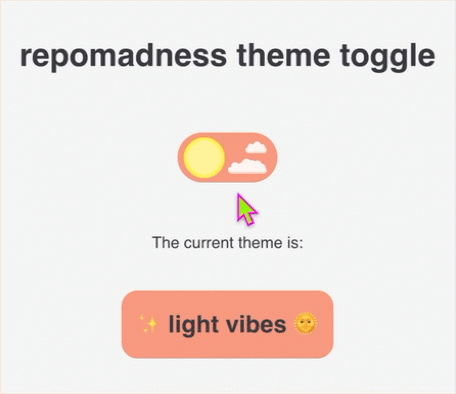

# repomadness theme toggle 🌗

A lightweight, framework-agnostic **custom theme toggle and theme provider** for React apps, powered by global CSS variables and the `data-theme` attribute for easy theming. Designed to isolate styling framework and app logic.



## features

- easy plug-and-play in any React app
- toggles between `light` and `dark` modes
- global CSS variaables via `data-theme` on `document.documentElement`
- shared theme state across components with no need for a global state manager
- CSS framework agnostic - works with plain CSS or any styling solution

---

## installation

```bash
npm install @repomadness/theme-toggle
```

Ensure you have `react` and `react-dom` installed as peer dependencies.

---

## usage

This package contains:

- `<ThemeProvider />` - wrapper to apply theme based on the `data-theme` attribute
- `<ThemeToggle />` - toggle switch that controls the theme state globally
- `useTheme()` - hook to programmatically access theme

### `ThemeProvider`

Wrap your app with the `ThemeProvider` to apply the `data-theme` attribute (`light` or `dark`) to the `<html>` tag and manage your CSS variable state globally.

```tsx
// main.tsx or App.tsx
import { ThemeProvider } from "@repomadness/theme-toggle";

<ThemeProvider>
  <App />
</ThemeProvider>;
```

### `ThemeToggle`

Give your app consumers the ability to control the theme state by adding the `ThemeToggle` component anywhere in your app.

```tsx
// Settings.tsx
import { ThemeToggle } from "@repomadness/theme-toggle";

export default function Settings() {
  return (
    <div>
      <h1>App settings</h1>
      <ThemeToggle />
    </div>
  );
}
```

### `useTheme()`

You can use the `useTheme()` hook to programmatically access the theme.

```tsx
import { useTheme } from "@repomadness/theme-toggle";

const { theme, toggleTheme } = useTheme();

console.log(theme); // "light" or "dark"
toggleTheme(); // manually switch theme
```

### style with CSS variables

Use `[data-theme="light"]` and `[data-theme="dark"]` to define your themes.

```css
:root {
  --color-bg: white;
  --color-text: black;
}

[data-theme="dark"] {
  --color-bg: black;
  --color-text: white;
}

body {
  background-color: var(--color-bg);
  color: var(--color-text);
}
```

---

## development

To run locally:

```bash
npm install
```

To run Storybook dev:

```bash
npm run storybook
```

Component and functional testing with Chromatic configured in `chromatic.config.json`. Tests can be ran locally via Visual Tests addon in Storybook.

For now, manual publishing to `npm` through CLI:

```bash
npm version patch
npm publish
```
